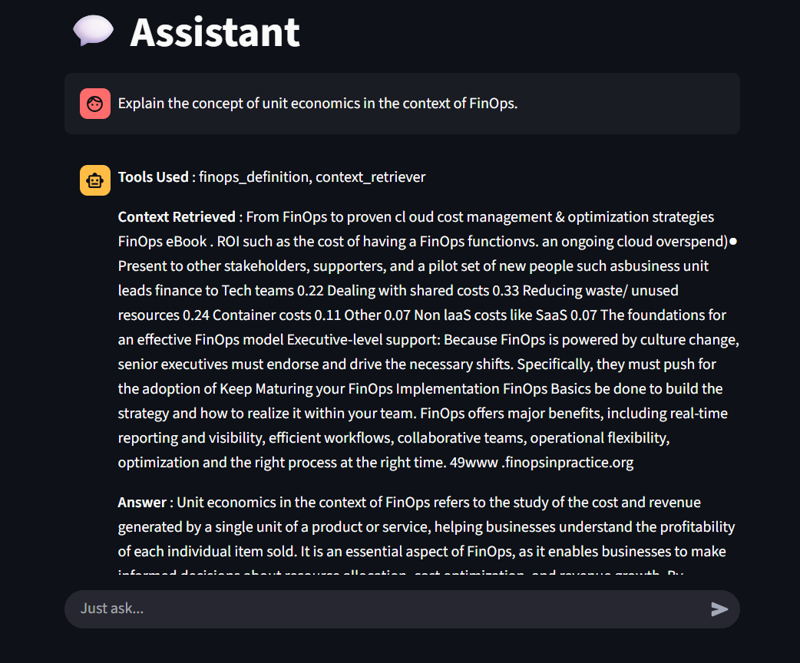

# 🤖 Assistant

> **Assistant** is an intelligent AI assistant that leverages **RAG (Retrieval-Augmented Generation)**,  
> **Groq LLaMA models**, and **Streamlit** to deliver fast, context-aware, and interactive answers.

---

## 📝 Description
**Assistant** is designed to simplify knowledge access by combining document retrieval,  
LLM-powered reasoning, and tool integrations.  

It can:  
- Answer user queries in natural language  
- Retrieve context from uploaded documents  
- Perform currency conversions using external APIs  
- Provide definitions and explanations with AI reasoning  

Built with a **Streamlit frontend**, **LangChain orchestration**, and **Groq-hosted LLaMA models**,  
Assistant delivers reliable, interactive, and real-time intelligence.

---

## ✨ Features
- 📚 **Context-Aware Q&A** — Retrieval-Augmented Generation (RAG) from uploaded documents.  
- 🤖 **Groq LLaMA Integration** — Harnesses ultra-fast inference from Groq-hosted LLaMA models.  
- 🔌 **External Tool Support** — Includes utilities like exchange rate lookup & domain-specific definitions.  
- 🧠 **Agent-Based Reasoning** — Uses LangChain ReAct agents for dynamic tool orchestration.  
- 📊 **Streamlit Frontend** — Interactive and minimal UI for seamless conversations.  
- 📝 **Centralized Logging** — Debug and trace with structured logs (`log.py`).  

---

## 🏗️ Tech Stack
- ⚡ **LangChain Agents** — Tool orchestration and reasoning  
- 🧠 **Groq LLaMA Models** — Core LLM powering answers  
- 🗂️ **Chroma VectorDB** — Document storage and semantic retrieval  
- 🐍 **Python** — Core programming language  
- 🌐 **Streamlit** — Frontend for user interactions  
- 🔑 **Environment Variables** — API key management for Groq + external services  

---

## 🏗️ Architecture
```plaintext
Assistant
├──app/
│    └── frontend.py # Main entry point (Streamlit UI)
├── utils
│   ├── tools.py # Custom tools (e.g., exchange rate lookup)
│   ├── log.py # Logging configuration
│   └── replier.py # Core logic for RAG + agent responses
│       
├── requirements.txt # Dependencies
└── README.md # Project documentation
```

## 🖥️ Demo


## 🚀 Live Demo
[Try Assistant here](https://assistant-finops.streamlit.app/) – Fully functional Streamlit UI version (includes all logic internally for deployment purposes).

## 📦 Installation & Setup

### 1️⃣ Clone the Repository
```bash
git clone https://github.com/your-username/assistant.git
cd assistant
```
### 2️⃣ Create & Activate Virtual Environment
```bash
python -m venv .venv
# On Linux/Mac
source .venv/bin/activate
# On Windows
.venv\Scripts\activate
```
### 3️⃣ Install Dependencies'
```bash
pip install -r requirements.txt
```
### 4️⃣ Setup Environment Variables
> Create a .env file in the root directory with the following values:
```bash
GROQ_API_KEY=your_groq_api_key
LLAMA_MODEL=llama-3.3-70b-versatile
EXCHANGE_RATE_API=your_exchange_rate_api_key
```
⚠️ Do not share your API keys publicly.

### 5️⃣ Run the Application
```bash
streamlit run app/frontend.py
```